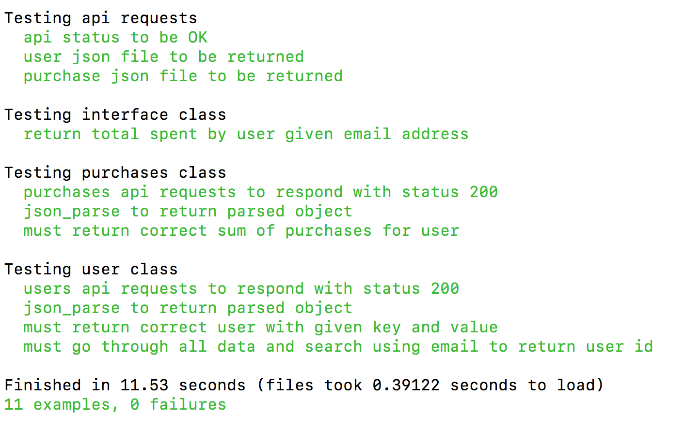

# Tech Test - API

I built this app with TDD approach and the view that I can change and scale it with new requirements.

I have not had much experience of using API's and manipulating large files
in JSON. So I really enjoyed this test as it was both challenging and gave me
an opportunity to learn new things.

I feel that I could have researched mocking API tests more thoroughly in order
to create isolation if I had more time. I did hit a stumbling block with the mock server as it produced the same data regardless of which page it was on and
therefore my guard conditions were not being triggered for content length.

I haven't completed all the requirements of the test. The two remaining
requirements are 'most_sold' and 'most_loyal'.


## Test Automation with Travis


Please click the link below for build report:
[https://travis-ci.org/bpourian/tech-test-rock/builds](https://travis-ci.org/bpourian/tech-test-rock/builds)

## Usage
Navigate to your project directory using your terminal and type in the following
```
$ git clone https://github.com/bpourian/tech-test-rock.git
```
Once cloning is complete change into the new directory
```
$ cd tech-test-rock
```
Make sure you run bundle
```
$ bundle install
```
To run the app use one of the following commands  

```
$ruby app.rb total_spend EMAIL
```

## File Structure
```
.
├── Gemfile
├── Gemfile.lock
├── README.md
├── app
│   ├── interface.rb
│   ├── purchases.rb
│   └── user.rb
├── app.rb
└── spec
    ├── features
    │   ├── api_status_spec.rb
    │   ├── interface_spec.rb
    │   ├── purchases_api_json_spec.rb
    │   └── user_api_json_spec.rb
    ├── spec_helper.rb
    ├── support
    │   ├── purchase_helper.rb
    │   ├── request_helper.rb
    │   └── user_helper.rb
    └── support_helpers.rb
```

## Test Coverage


